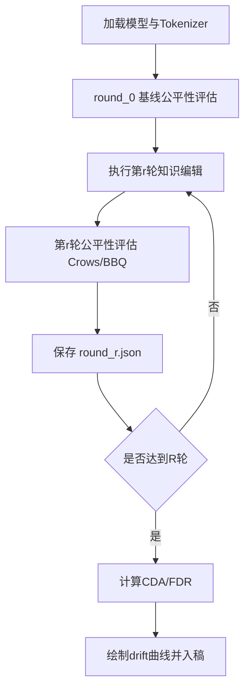

# 实验流程图与表格骨架

## 1. 实验流程图（Mermaid）

## 2. 表1：基线结果
| 模型 | 数据集 | 指标 | 数值 |
|---|---|---|---|
| GPT-2 | CrowS-Pairs(sample) | prefer_stereo_rate | 0.600 |
| GPT-2 | BBQ(sample) | accuracy_proxy | 0.200 |

## 3. 表2：轮次漂移结果模板
| Round | Edited Items | CrowS prefer_stereo_rate | BBQ accuracy_proxy | 相对基线变化 |
|---|---:|---:|---:|---|
| 0 | 0 | 待填 | 待填 | 基线 |
| 1 | 1 | 待填 | 待填 | 待填 |
| 2 | 2 | 待填 | 待填 | 待填 |
| 3 | 3 | 待填 | 待填 | 待填 |

## 4. 表3：方法对照模板
| 方法 | 是否跑通 | 资源要求 | 编辑成功性 | 公平性漂移 | 备注 |
|---|---|---|---|---|---|
| FT | 是 | 中 | 待填 | 待填 | 当前主线 |
| ROME | 待GPU | 高 | 待填 | 待填 | 需稳定环境 |
| MEMIT | 待GPU | 高 | 待填 | 待填 | 需稳定环境 |
| MEND | 待GPU/权重 | 高 | 待填 | 待填 | 依赖训练权重 |
